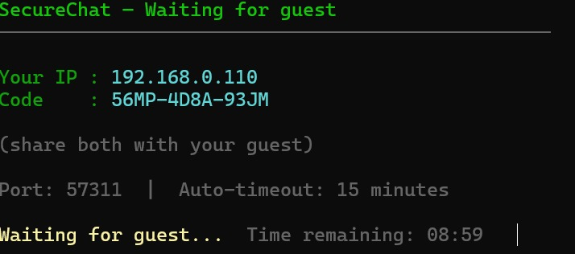
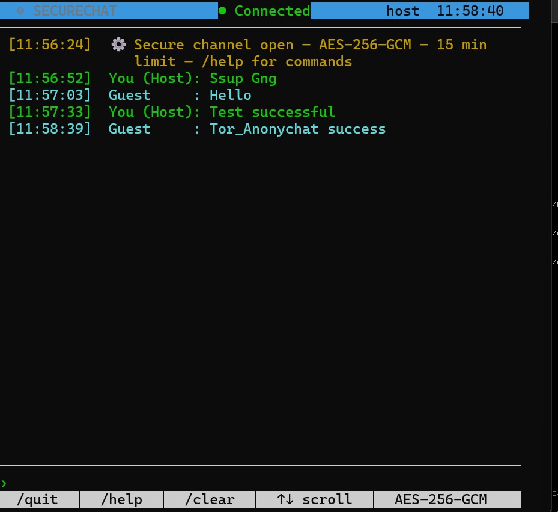

*TOR_ANONYCHAT*

## What is it?

SecureChat is a zero-knowledge ephemeral chat application that runs entirely in your terminal. Two people connect directly through a Tor hidden service using a one-time session code. When the session ends — or times out — every trace is wiped from memory. Nothing is written to disk.
File transfer is built in. You can send any file up to 256 MB, encrypted with the same AES-256-GCM session key as your messages, with SHA-256 integrity verification on receipt.
---
*Security model*
EncryptionAES-256-GCM — authenticated encryption, no separate MAC needed.
Key derivationPBKDF2-HMAC-SHA256, 310,000 iterations (OWASP 2023 minimum).
Nonce12 bytes, random per message — NIST SP 800-38D.
TransportTor hidden service — no IP address ever leaves either machine.
Session codeOne-time use, 46-bit entropy, unambiguous Base32 alphabet.
LogsNone. No history. No files written to disk by the app.
Timeout15-minute hard session limit, 5-minute warning.
KeepalivePING/PONG every 30 seconds — dead connections detected within 40 secs.

## Requirements

| Requirement | Details |
|---|---|
| **OS** | Linux (Kali, Ubuntu, Debian), macOS, Git Bash / WSL on Windows |
| **Python** | 3.8 or newer (`python3 --version`) |
| **Library** | `cryptography` — auto-installed by `run.sh` |
| **Network** | Both machines must be able to reach each other over TCP (same LAN, or VPN, or port-forwarded) |

---

## Installation

```bash
# 1. Clone or download and unzip
https://github.com/Br1an-devs/Tor_Anonychat 
cd Tor_Anonychat

# 2. Make the launcher executable
chmod +x run_tor.sh

# 3. (Optional) Install the Python dependency manually
pip install cryptography
```

That's it. No build step. No compilation.

**For detailed instructions on how to use secure chat [*CLICK HERE*](./Test-sample/instructions.txt)**
# SecureChat — Tor Hidden Service

## How to use

### Before first use — one-time setup (HOST only)

Run these commands once to create your hidden service and get your permanent onion address:

```bash
# 1. Add the hidden service block to Tor config
sudo bash -c 'printf "\n# SecureChat\nHiddenServiceDir /var/lib/tor/securechat\nHiddenServicePort 57311 127.0.0.1:57311\n" >> /etc/tor/instances/default/torrc'

# If /etc/tor/instances/default/torrc does not exist on your system, use this instead:
sudo bash -c 'printf "\n# SecureChat\nHiddenServiceDir /var/lib/tor/securechat\nHiddenServicePort 57311 127.0.0.1:57311\n" >> /etc/tor/torrc'

# 2. Create the hidden service directory with correct ownership
sudo mkdir -p /var/lib/tor/securechat
sudo chown debian-tor:debian-tor /var/lib/tor/securechat
sudo chmod 700 /var/lib/tor/securechat

# 3. Restart the Tor instance
sudo systemctl restart tor@default

# 4. Wait ~15 seconds, then read your onion address
sleep 15 && sudo cat /var/lib/tor/securechat/hostname
```

Your onion address will look like:
`abcdef1234567890abcdef1234567890abcdef1234567890abcdef12.onion`

**Save this address. It is permanent as long as you keep the keys. **

---

### Get your onion address any time 

```bash
sudo cat /var/lib/tor/securechat/hostname
```

Or use **option ** in the app menu.

---
**Running on LAN without TOR**
# Host
bash run.sh host --port 57311

# Guest
bash run.sh connect --port 57311

## Session flow

### HOST
1. Run `bash run_tor.sh`
2. Choose **option 3** to view your onion address (or read it from terminal above)
3. Choose **option 1** — Host a session
4. Paste your onion address when prompted
5. A session code is generated and displayed
6. Send **both** the onion address and session code to your guest via phone call, Signal, or any out-of-band channel
7. Wait for the guest to connect

### GUEST
1. Run `bash run_tor.sh`
2. Choose **option 2** — Join a session
3. Enter the onion address sent by the host
4. Enter the session code sent by the host
5. Connection established

---

## Security notes

- Never share the onion address or session code over unencrypted channels
- The session code is one-time use only
- No logs, no history, no IP addresses leave either machine
- All messages are encrypted with AES-256-GCM

  **THIS IS WHAT IT LOOKS LIKE**
  *For host side*(**WLAN Ip Address Is shown just Incase it is a local Wlan connection**)
  <p align="center">
  
</p>
After connection Terminal Looks Like this
<p align="center">
  
</p>

Have fun.
**FOR SUPPORT🤝**


[](https://ko-fi.com/briandevs)
